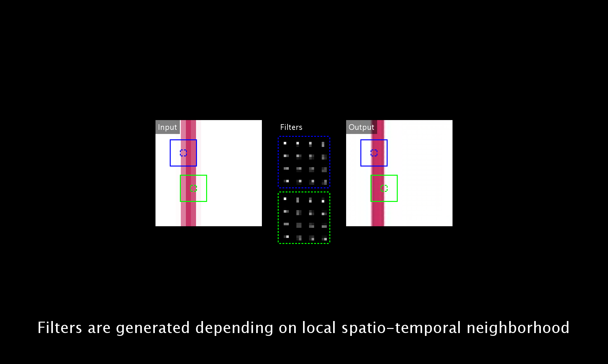

# Deep Video Super-Resolution Network Using Dynamic Upsampling Filters Without Explicit Motion Compensation

This is a tensorflow implementation of the paper. [PDF]()

## directory
`./inputs/G/` Ground-truth video frames  
`./inputs/L/` Low-resolution video frames  
  
`./results/<L>L/G/` Outputs from given ground-truth video frames using <L> depth network  
`./results/<L>L/L/` Outputs from given low-resolution video frames using <L> depth network

## test
Put your video frames to the input directory and run `test.py` with arguments `<L>` and `<T>`.
```
python test.py <L> <T>
```
`<L>` is the depth of network of 16, 28, 52.
`<T>` is the type of input frames, `G` denotes GT inputs and `L` denotes LR inputs.

For example, `python test.py 16 G` super-resolve input frames in `./inputs/G/*` using `16` depth network.

## video
[](./supple/VSR_supple_crf28.mp4?raw=true)

## bibtex
```
@InProceedings{Jo_2018_CVPR,
	author = {Jo, Younghyun and Oh, Seoung Wug and Kang, Jaeyeon and Kim, Seon Joo},
	title = {Deep Video Super-Resolution Network Using Dynamic Upsampling Filters Without Explicit Motion Compensation},
	booktitle = {The IEEE Conference on Computer Vision and Pattern Recognition (CVPR)},
	year = {2018}
}
```

